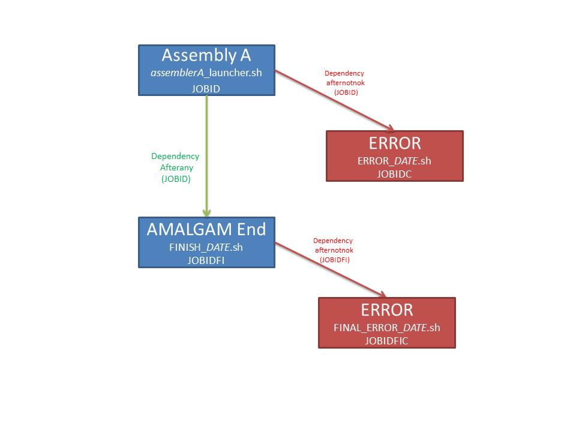
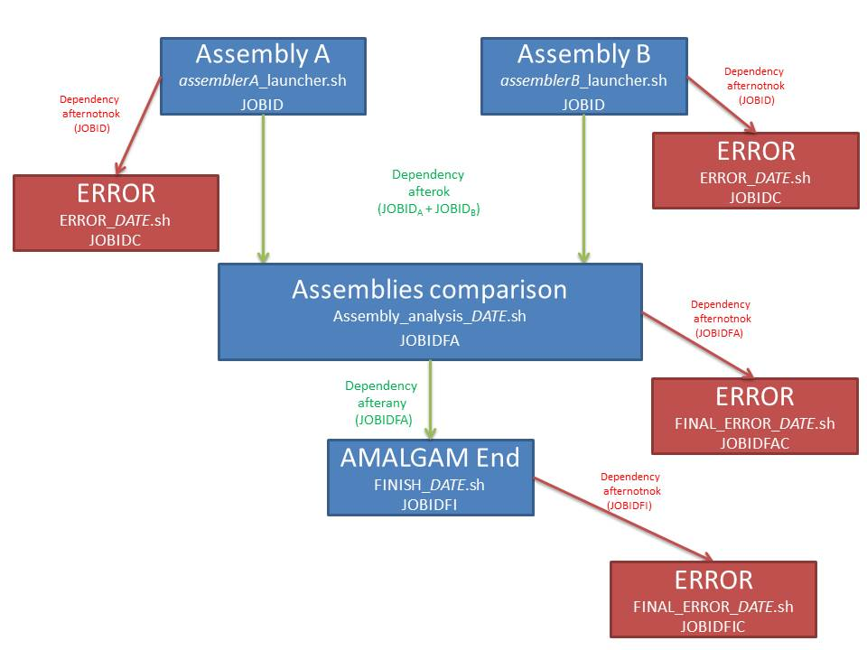

# Documentation for AMALGAM users

# About AMALGAM

Endless improvements of Next-Generation Sequencing (NGS) lead to constantly increasing sequencing data that serve various studies such as metagenomics, transcriptomics or Whole Genome Sequencing (WGS) projects. De novo assembly of raw data from WGS projects was tedious task requiring a strong expertise. With the recent development of powerful tools assembly process is now within reach of "standard" bioinformaticians. However, complexity of the process can arise with the choice of the tool, the latter depending on the nature of data (huge amount of short high quality reads vs few long and noisy reads) and the issue to address (assembling an isolate vs a collection of genomes included in a complex sample).
AMALGAM have two features :
The first is to make easier the assembly process. From raw data AMALGAM is able to make a complete assembly that is not only make an assembly but also make a finishing step to gap filling and to make an assembly results evalution. Dependencies of requested tools is automatocally manage.
The second feature is with one command line, AMALGAM is able to make sevral assemblies simultanenously on the same data set and with sevral assemblers. At the end of all individuals assemblies an evaluation and a comparison of all results is made and users can choose the best assembly.
# 1 Integrated tools
AMAGAM is able to make one or several assembly(ies) simultaneously, finalise and evaluate each one. When several assemblies are made at the same time, a comparison of all is done. To do all steps, several types of tools have been selected to be integrated in AMALGAM in order to adapt to the data and provide the best results. For assemblers, several tools are integrated in order to propose to the user different assemblies possibilities.  
At this moment, all used tools are present as a module on computational clusters and are automatically loaded at the beginning of an AMALGAM running.
All integrated tools in AMALGAM are open source.
## 1.1 Assemblers
Curently, some powerful assemblers exists and enable to make assemblies on many types of sequencing data. In order to allow users to make the best assembly with his libary, a bibliographic study was carried out. The most used assemblers which present the best results were chosen to be integrated in AMALGAM. Each use different types of algorithms, and therefore, several approaches. This diversity enable users to will be able of choosing the best assembly result for his data set.
AMALGAM has been developed for Illumina short reads and Nanopore/PacBio long reads. Other types of short reads can be assembled but AMALGAM do not manage them. You can check assembler's documentation to add your data in AMALGAM but must be careful about AMALGAM results.
### 1.1.1 SPAdes
[SPAdes](# References) is a toolkit of assembly pipelines. This assembler uses De Bruijn Graph approach and was designed for small genomes (tested on bacterial, fungal and other small genomes).  
Integrated version of SPAdes is 3.10.1 (March 1st, 2017) and was released under GPLv2 licence.  
In AMALGAM, SPAdes is used to make short reads and hybrid assemblies.  
Firstly, for short reads assemblies, SPAdes is able to assemble paire-end, mate-pairs and single-end reads.
Then, SPAdes is also able to make hybrid assembly and use PacBio CLR and Nanopore long reads in addition to short reads. To make an hybrid assembly SPAdes uses a SPAdes module named [HybridSPAdes](## References). To sum up about this algorithm, the first step is a graph assembly construction with short reads. Then, long reads are mapped to the graph to generate reads path. The latter is used to resolving repeats in assembly graph. Long reads are also used to close gaps in the assembly graph.  
Aside from AMALGAM, SPAdes tool is able to assemble IonTorrent, Sanger and PacBio CCS reads and can take as input several libraries simultaneously.
SPAdes accepts gzip-compressed files and AMALGAM can take these compressed files without specific parameters.
### 1.1.2 IDBA-UD
[IDBA_UD](# References) is a de-novo assembler for short reads with highly uneven sequencing depth from single-cell or metagenomic sample. The assembler has a de Bruijn Graph approach. IDBA_UD is able to assemble single-end, paire-end and mate-paire sequences.  
Integrated version of IDBA_UD is 1.1.3 (July 11th, 2016) and was released under GPLv2 licence.  
IDBA_UD accepts only one Fasta file. Consequently, before making an assembly, there is an initial step which consist to concatenate Fastq file when there is forward and reverse files and  to convert librarie file format from Fastq to Fasta. IDBA_UD contains in his package tools to make required conversions. This steps are integrated in AMALGAM.  
IDBA_UD do not accepts compressed files. If you want to make an assembly with compressed files, please decompress your files yourself beforehand to used them in AMALGAM.
### 1.1.3 ABySS
[ABySS](# References) is an assembler designed to assemble large genomes from short reads and it has been shown to be fast and equally effective for small genomes. That's why it is integrated in AMALGAM. This assembler is based on de Bruijn graph approach.  
ABySS accepts single-end or paire-end sequences. Mate-paired sequences are not accept for an ABySS assembly within the scope of AMALGAM because ABySS uses mate-paired sequences to scaffold an assembly and this option is not an AMALGAM issue.  
In articles, ABySS was tested with Illumina sequences, same sequences that will be used to developpe AMALGAM. Using other types of sequences does not assure the smooth running of ABySS. For AMALGAM standardization, Fastq format is required but, ABySS can accept compressed files(gzip or bzip2) or other sequences formats (see ABySS documentation to know accepted format) but other format are probably not taken into account by other assemblers.
ABySS has some options no integrated in AMALGAM because only assemblies of short genomes are made. These options enable to reduce memory consumption to make assemblies by using a Bloom filter de Bruijn graph or paired de Bruijn graph. ABySS is also able to build a parallel assembler with it integrated mpi module. Like SPAdes, ABySS is able to assemble multiple libraries but this possibility is not available in AMALGAM.
Integrated version of ABySS is 2.0.2 (October 22nd, 2016) and was released under GPLv3 licence.  
Particularity of ABySS in AMALGAM:  
AbySS required a k-mers length parameter while the others assemblers determine the most suitable k-mer length. So, for ABySS, in AMALGAM, the user can specify k-mers length(s), otherwize k-mer length is/are defined by AMALGAM and assembly(ies) are made for each k-mer length(s). The détermined k-mer length(s) is/are included between the smallest and the largest reads length.
### 1.1.4 Canu
[Canu](# References) is an assembler derived from the CelerAssembler tool. Canu is designed to assemble high-noisy and long single molecule sequences from bacterial and eukaryotic genomes. It is possible to make assemblies with from both long reads technologies (PacBio and Nanopore).   
Canu is autonomous for resources and parameters management. It is able to detect on which computational grids it is launched, available resources, and with genome size it is able to allocate necessary parameters for each jobs and adapts this assembly parameters according to the technology sequences providing (i.e error rate). The user as the possibility to define is own parameters by a specification file which bring together parameters to used in addition to default parameters. In AMALGAM this file is required.  
Canu pipeline consists on three stages: Correction, Trimming and Assembly. these steps are done in AMALGAM but Canu assembler propose to do them separately.  
For input files, Canu accept raw or corrected long reads sequences but in AMALGAM for file standardization between all the assemblers only raw sequences are accepted (correction step is automatically performed). AMALGAM can accept some compressed files (gzip,bzip2 or xz compressions) without specific parameters.
Integrated version of Canu is 1.4  (December 13th, 2016) and was released under GPLv2 licence.
## 1.2 Assembly finishing
### 1.2.1 GapCloser
GapCloser come from [SOAPdenovo2](# References) package. It is designed to close gap arise from the scaffolding process during the assembly step. GapCloser approach is to use the pair relationships of shorts reads using to make the assembly.
This tool can be used on large plant, animal, bacteria and fungi genomes.
A configuration file is required, this last is written by AMALGAM with appropriates data.
Integrated version of GapCloser is 1.12 under GPLv3 licence.
### 1.2.2 Pilon  
[Pilon](# References) is an all in one tool for comprehensive genome improvement and variant detection on prokaryote and eukaryote genomes. In AMALGAM, Pilon is used in finishing step of long reads assemblies. It make a correction of draft genomes by correcting bases, fixing mis-assemblies and filling gap emerging of the assembly step.
This tools required several types of data :
* A genome in Fasta format represented in AMALGAM by a long reads assembly.
* A BAM file, here, produced by an alignement of short reads on the long read alignment.  
So, to use this tool an AMALGAM user should give short and long reads.  
To overview the Pilon worklow, it make a comparion between aligned sequences and reference input sequence.  
Integrated version of Pilon is 1.21 (December 9th, 2016) under le GPLv2 licence.

## 1.3 Assembly evaluation
### 1.3.1 Quast/Icarus
[Quast](# References) and [Icarus](# References) tools form an assembly evaluation package.  
To begin, Quast is a quality assessment tool for evaluation and comparison of genome assemblies (bacterials and humans genomes). It calculates some common metrics (also calculated by other evaluation tools) and extend them to new metrics specific to QUAST. Results are available in the form of tables or graphs. These latter may help scientits in their research and in their publications.
In order to make an assembly evaluation, the user can specify a reference genome, however, Quast tool is able tu evaluate an assembly enven without reference genome but fewer metrics will be calculated.
Icarus is a complementary tool to QUAST. This is a genome visualizer for an accurate assessment and an analysis of a genomic draft genome assembly. It is based on Quast analysis results, it detects similarities and create web page for visualization in a web browser.
This tool enable to make a global visualization of the assembly and to zoom on a local view to see more details on a region of interest.
Two outputs are offer to users. The first is always present, this is a contig size viewer. This web page represent contigs from the smallest to the biggest. The second is present only when a reference genome is specified. This is a contigs alignment viewer and represent contigs aligned on the given reference genome. For each viewer when a reference genome is specified, a colour coding is proposed to indicated good or bad contigs alignments. Icarus is able to make a visualization of genes / operon if data are specified. This possibility is not integrated yet in AMALGAM.

An evalation Quast/Icarus is done for each assembly and compare :
* For an assembly of short reads :Contigs, scaffols and scaffolds after gap filling step
* For an assembly of long reads: Contigs and, when finishing step is done, contigs after treatment.

When sevral assemblies are made, a comparison between all of the assemblies is done. For an assembly with short and longs reads (hybrid or long reads with finishing), a comparison is also
made.  
Integrated version of Quast is 4.5 (March 17th,2017) under the GPLv2 licence, Icarus is distribued within QUAST package.

## 1.4 Other tools
### 1.4.1 BWA
[BWA](# References) is a software package for mapping sequences against a large reference genome. BWA consist of three algorithms: BWA-backtrack, BWA-SW and BWA-MEM. In AMALGAM, only BWA-MEM is used. Briefly, BWA-MEM algorithm works by seeding alignments with maximal exact matches (MEMs) and then extending seeds with the affine-gap Smith-Waterman algorithm (SW).
Integrated version of BWA is 0.7.15 (June 1st, 2016) under the GPLv3 licence, MIT License.
### 1.4.2 Samtools
[SamTools](# References) is a package composed of several programs for interacting with high throughput sequencing data. Samtools programs are able to manipulating alignments in the BAM (Binary Alignment/Map) and SAM (Sequence Alignment/Map) format. They can reading, writting, editing, indexing and viewing SAM/BAM/CRAM formats.
Integrated version of Samtools is 1.5 (June 21st, 2017) under BSD License, MIT Licenses

# 2. AMALGAM pipline
AMALGAM offers great assembly possibilities (short reads, long reads and hybrid) and also makes it possible to compare them. In order to make these different assemblies and evalated them, several tools are integrated to make differents paths leading to the results.
## 2.1 Short reads assembly
Short reads assembly is a part of AMALGAM with the greatest diversity of assembly approach. At present, three assemblers are able to make this kind of assembly, there are [SPAdes](### 1.1.1 SPAdes), [ABySS](### 1.1.3 ABySS), and [IDBA-UD](### 1.1.2 IDBA-UD). With one command line the user has the possibility to make only one assembly or more with several assemblers. In this last case, a results comparison is automatocally done.

Process for one assembly (From assembly to evaluation):

1. Make assembly (Check libraries and compression files, file conversion (required for IDBA-UD), assembly, backup of contigs, scaffolds and log files and extraction of resulted insert size).
2. Finalisation of the assembly by gap filling. This step uses [Gap Closer](# 1.2.1 GapCloser) tool (Write configuration file and Gap Closer execution).
3. Creation and backup of Agp files from contigs resulting from the gap filling step.
4. Final evaluation of the made assembly by [Quast/Icarus](# 1.3 Assembly evaluation). For this step, contigs, scaffolds and scaffolds after finishing are used.

*Fig 1: Process of short reads assembly when one assembly is required. Blue boxes represent main steps described previously and red boxes represent script executed when main steps failed. For each box, script and jobid name are pointed out and described in [Error management part](### 6. Error management)*

When several assemblies are requested, approach is  :  
1. For each assembly, the previous process is done (assembly, gap filling, agp files and evaluation)
2. When all assemblies are succesfully completed, the last step is a comparison of all with Quast/Icarus. For each assembly, contigs and scaffols after finishing are compared. This final step gives a complete view of all the made assemblies, and thus allows the user to choose the best assembly.

*Fig 2: Process of short reads assembly when multiple assemblies are required. Blue boxes represent main steps described previously and red boxes represent script executed when main steps failed. For each box, script and jobid name are pointed out and described in [Error management part](### 6. Error management)*

Short reads assembly process was tested with all assemblers on two libraries of 2.0m and 6.3m each. Respectively completion times was 10 to 30 minutes and 30 minutes to 3 hours.

## 2.2 Long reads assembly
Only one assembler on long reads has been integrated in AMALGAM. This tool is [Canu](### 1.1.4 Canu). It allows to assemble  Nanopore or PacBio long reads alone as weel as to assemble Nanopore and Pacbio reads together. All this assemblies are possible in AMALGAM with raw sequences and for PacBio, only CCS reads can be specified.  

General process for Canu is :
1. Assembly with [Canu](### 1.1.4 Canu) (Check libraries files and compression, assembly and backup of contigs file)
2. In some cases, finishing step with corrections and gap filling.
3. Agp files are created and saved.
3. Assembly evaluation with [Quast/Icarus](### 1.3.1 Quast/Icarus).  

The second step required short reads sequences, so when only long reads are specified, the finishing/correction step in not made.

### 2.2.1 Without assembly correction
Like short reads are required for long reads correction/fishinig step, asssembly results are not improved. Contigs resulting from the assembly are used to make Agp files and evaluation.
### 2.2.2 With assembly correction
When short reads are available this second step is made. Tool which is able to make a correction and a finishing of Canu assembly is [Pilon](### 1.2.2 Pilon). This tool required two inputs : a genome and an alignement on this genome. Genome correspond to the Canu assembly and the second input is an alignement of short reads on assembled long reads in BAM format. So to use Pilon, preliminaries steps are requested. This steps are :
1. Alignement of short reads on long reads assembly. BWA tool is used. First, it makes reference indexation with _"index"_ command then an alignement with _"mem"_ command. The returned alignement is in SAM format.
2.  BAM file with ordered and indexed sequences are required for Pilon, so the following step is to convert BWA previous result in required format for Pilon. For all these steps, several programs of Samtools are used : _"view"_ to convert SAM file in BAM file, _"sort"_ to sort alignments by left-most coordinates and _"index"_ to index a sorted BAM file.
3. Pilon execution with Canu assembly and BAM file.
4. The last step is an evalution of results with Quast/Icarus tool. Compared files are contigs before and after finishing step.  

Agp files are made with contigs resulting from the gap filling step.  
The combination of short and long reads libraries can be used as much for long reads assembly with finishing as for hybrid assembly, it is thus possible to make two assemblies in parallel and compare them.
### 2.2.3 Canu monitoring
To make an assembly, Canu execute several jobs on computational clusters but AMALGAM is able to supervise only one job. Consequently, AMALGAM start following steps from the end of the first Canu step. As Canu assembly is not terminated AMALGAM following steps and more exactly long reads pipeline fails while assembly is still running.
In order to wait the end of an assembly with Canu, a monitoring step is put in place. This monitoring check each Canu step. This monitoring enable to determine whether an assembly is running, succesfully completed or fails.  
Furthermore, Canu managed automatically these assemblies on calculations grids. On Slurm clusters, Canu fails with errors that are related to this management (availabilities are poorly assigned). The monitoring described here will be able to detect Canu errors and inform the user. To complete a failed Canu assembly see [6.2 Error message](## 6.2 Error message).
## 2.3 Hybrid assembly
An hybrid assembly required short **and** long reads. Only one integrated assembler, [SPAdes](### 1.1.1 SPAdes),  is able to make this assembly. Compared to a short reads assembly with this assembler, no specific parameters are required. AMALGAM automatically detects that an hybrid assembly need to be performed.
Reads should not be pre-corrected. In AMALGAM, Illumina short reads and PacBio **or** Nanopore long reads are required.
For this assembly, we recommand to increase the number of theards (cpu) and memory limit compared to an assembly of short reads with SPAdes.  
The AMALGAM process for a hybrid assembly is the same as a short reads assembly [Short reads assembly](## 2.1 Short reads assembly).  
On the same data set (short and long reads), it is possible to make simultaneously hybrid assembly and long read assembly with finishing. You must only specified that you want to used SPAdes and Canu assemblers. At the end of these assembly a comparison is done.  

Still on the same libraries, completions times on hybrid assembbly process are 45 minutes for a library of 2.0m and 4 hours for the second library of 6.4m.

NB : For each type of assemblies described, there are several steps to check tools availability and to create required repositories for AMALGAM running.

# 3. AMALGAM parameters
## General options
-P | --project\_name  _< name of the projet >_  
&nbsp;&nbsp;&nbsp;&nbsp;Name of the project. This name will be used to names results files by some tools.  
-o | --output\_path _< Output Directory >_  
&nbsp;&nbsp;&nbsp;&nbsp;Path of the output directory.  
-m | --mate-paired  
&nbsp;&nbsp;&nbsp;&nbsp;Shift argument. Specify it if you used mate-paired data. By default, paire-end is activated.  
-R | --reference\_genome _< File >_  
&nbsp;&nbsp;&nbsp;&nbsp;Optional. Reference genome is used only in Quast/Icarus analysis. Assembly results can be aligned on the reference.
-M | --metagenome  
&nbsp;&nbsp;&nbsp;&nbsp;Shift parameter. Specify it if you want to assemble metagenome data.  
--partition  _< name of the partition >_  
&nbsp;&nbsp;&nbsp;&nbsp;Name of slurm partition to use to make assemblies. Possible partitions : xlarge, normal, small (Default : xlarge). All steps which are performed in clusters will be launch on this partition.
On small partition, there is 7,8Go per thread, consequently, like SPAdes is memory greedy, you must specify correct memory quantity to used. By default, SPAdes used 300Gb of memory so with small partition an error is returned.
## Library files
Reads should not be pre-treated. This step is made by assemblers tool. For paire-end librairies, only forward and reverse reads are required. Unpaired reads are not accepted.  

-s | --se _< File >_  
&nbsp;&nbsp;&nbsp;&nbsp;Single-end library file in Fastq format.  
-p | --pe _< File >_  
&nbsp;&nbsp;&nbsp;&nbsp;Paire-end library in one Fastq file. Reads must be interlaces (read1.1,read1.2,read2.1,read2.2...)  
-f | --pe-forward _< File >_  
&nbsp;&nbsp;&nbsp;&nbsp;Forward paire-end file in Fastq file.  
-r | --pe-reverse _< File >_  
&nbsp;&nbsp;&nbsp;&nbsp;Reverse paire-end file in Fastq file.  
-n | --nanopore _< File >_  
&nbsp;&nbsp;&nbsp;&nbsp;Nanopore file in Fastq format.  
-b | --pacbio _< File >_  
&nbsp;&nbsp;&nbsp;&nbsp;PacBio CLR file in Fastq format.  

## Assemblers
--spades  
&nbsp;&nbsp;&nbsp;&nbsp;Use SPAdes assembler to assemble your library. You must specify some arguments:  
          &nbsp;&nbsp;&nbsp;&nbsp;cpu=_< Int >_&nbsp;&nbsp;&nbsp;&nbsp;(Required) Numer of CPU to use for this assembler.  
          &nbsp;&nbsp;&nbsp;&nbsp;memory=_< Int >_&nbsp;&nbsp;&nbsp;&nbsp;(Optional) Memory, in gigabytes, to use for this assembly. By default, memory=300.  
--idba  
&nbsp;&nbsp;&nbsp;&nbsp;Use IDBA\_UD assembler to assemble your library. You must specify one argument:  
          &nbsp;&nbsp;&nbsp;&nbsp;cpu=_< Int >_&nbsp;&nbsp;&nbsp;&nbsp;(Required) Number of CPU to use for this assembler.  
--abyss  
&nbsp;&nbsp;&nbsp;&nbsp;Use ABySS assembler to assemble your library. You must specify some arguments:   
          &nbsp;&nbsp;&nbsp;&nbsp;cpu=_< Int >_&nbsp;&nbsp;&nbsp;&nbsp;(Required) Numer of CPU to use for this assembler.  
          &nbsp;&nbsp;&nbsp;&nbsp;kmer=_< Int >_&nbsp;&nbsp;&nbsp;&nbsp;(Optional) Kmer length to use for an assembly with ABySS. Some values are possible : 32,64,96,128. By default, AMALGAM is able to choose kmer length according to the reads length and make as much assembly as kmer can be used. For example : kmer=128.  
--canu _< Int >_  
&nbsp;&nbsp;&nbsp;&nbsp;Use Canu assembler to assemble your library. You must specify some arguments:  
          &nbsp;&nbsp;&nbsp;&nbsp;cpu=_< Int >_&nbsp;&nbsp;&nbsp;&nbsp;(Required) Numer of CPU to use for finishing/correction step.  
          &nbsp;&nbsp;&nbsp;&nbsp;step=_< String >_&nbsp;&nbsp;&nbsp;&nbsp;(Optional) Step that you wants to make. Specify "assembly" to make complet assembly (assembly and finishing/correction) or "finishing" to make only finishing/correction step (the assembly was previously done). By default step=assembly   

## Long reads assembly options

-c | --corrected-long-read _< List >_  
&nbsp;&nbsp;&nbsp;&nbsp; (Required when long reads are specidied) List of two booleans. This boolean specify if long reads are corrected. The first is for Pacbio ans the second for Nanopore. By defaut, we consider that reads are not corrected (false,false).  
&nbsp;&nbsp;&nbsp;&nbsp;For example: write "false,true" if you have Nanopore corrected reads.  
--canuSpecFile  _< File >_  
&nbsp;&nbsp;&nbsp;&nbsp;(Required when Canu is used) Specification file used by this assembler.

## Module loading
From Genoscope, a profile is available to use AMALGAM. This profile load an environment with all modules required for AMALGAM usage. Prompts is modified when AMALGAM profile is loaded.  
To load it from blank space (ssh -t etna0 '/bin/bash'):
&nbsp;&nbsp;&nbsp;&nbsp;source /env/cns/proj/agc/module/profiles/AMALGAM.profile
## AMALGAM command
Below are given exemples to make defferents AMALMGAM executions. During an AMALGAM execution, an assembler can be requested only once. Realisation of several assemblies with the same tool will lead to confilits in the results which can lead to inaccurate results.

### For short reads assemblies
amalgam \  
-P <*Projet_Name*> -o <*output_direcyory*> \  
-f <*forward_reads_file*> -r <*reverse_reads_file*> \  
--spades cpu=<*INT*> \  
--abyss cpu=<*INT*>,kmer=<*INT*> \  
--idba cpu=<*INT*> \  
-R <*Reference_sequence*>

### For long reads assembly
amalgam \  
-P <*Projet_Name*> -o <*output_direcyory*> \  
-f <*forward_reads_file*> -r <*reverse_reads_file*> \  
--nanopore <*Long_reads_file*>  and/or --pacbio <*Long_reads_file*> \  
--spades cpu=<*INT*> \  
-R <*Reference_sequence*> \  
--canuSpecFile  <*Specification_file*>\  
-S <*Sequence_length*> \  
--canu cpu=<*INT*>  

Option : add "--spades cpu=<*INT*>" at this command line to make hybrid assembly simultanenously.

### For hybrid assembly
amalgam \  
-P <*Projet_Name*> -o <*output_direcyory*> \  
-f <*forward_reads_file*> -r <*reverse_reads_file*> \  
--nanopore | --pacbio <*Long_reads_file*> \  
--spades cpu=<*INT*> \  
-R <*Reference_sequence*>

## Summary table with assemblers and libraries options

|Assemblers ->   --------   Type of assemblies  |     SPAdes                                                                                |   IDBA-UD                 |    ABySS                 |   Canu      |
| :--------------------: | :---------------------------------------------------------------------------------------: | :---------: | :---------: | :---------: |
|**Short reads assembly (Illumina)**| Single-end Paire-end Mate-paired                                                    |      Paire-end Mate-paired|Single-end Paire-end   | |
|**Long reads assembly (Nanopore/PacBio)** | | | |Nanopore PacBio Nanopore and PacBio|         
|**Hybrid assembly (Illumina and Nanopore/PacBio)**    | For short reads: Single-end or Paire-end or Mate-paired Long reads : Nanopore or PacBio| | | | |
# 4. AMALGAM results
An AMALGAM projet is equivalent to an AMALGAM execution no matter the number of assemblies to do. When an AMALGAM execution is asked a reposiory is created (if it is not done yet) named with the project name and all informations, results, files related to this execution is save in this repository. This latter is itself composed of subfolders :
### 4.1 Assemblies results
In the output repository, each assembly results are saved in independent repositories named with the assembler tool name and for ABySS assembler it is followed by the kmer length used to make the assembly.
In these repositories are saved files/repositories write by the assembler and repositories made by AMALGAM. These last are :
* backup : This repository is a backup of assembly results. For short reads, and hybrid assemblies it contains files with contigs, scaffolds and scaffolds after Gap Closer sequences, log assembler files and agp files. For long reads assembly, saved files are contigs before and after Pilon step (except when finishing step is not made) and agp files. This files can be used for next analysis.
* Quast : This reposiory contains all files/repository from QUAST/Icarus analysis. Here, there is only an evaluation of an unique assembly. This evaluation make an analysis of contigs, scaffolds and scaffolds after Gap Closer step. Open *icarus.html* file with a web browser to see interactif report.
### 4.2 Final analysis repository
This repository is present only when several assemblies are requested and a comparison has to be made. It contains QUAST/ICARUS evalution and comparion of all assemblies done in the project. Two files per assemblies are used for the comparison: contigs and scaffolds after finishing step. The purpose of this analysis is to give an overall view of the assemblies made for the library and highlighted best assembly(ies).
### 4.3 Log files reposiory
As AMALGAM does many steps, it is important to print log to allow experimented users to follow AMALGAM process. Furthermore, when errors are returned, in AMALGAM.log file, log files are highlighted and allow users to identify the problem to correct.
This reposiory contains two types of files : Log file which contains log write by AMALGAM and standard/errors outputs from clusters jobs.
#### 4.3.1 AMALGAM.log file
Important log informations about AMALGAM execution are reported in this file:  

- AMALGAM Start and End execution indicator.
- Date and time of AMALGAM launch.
- AMALGAM version.
- General informations on AMALGAM execution : Output repository, project name, presence of reference genome and if the sample is a metagenome.
- Library files : Reads files path with their library type.
- Type of assembly : Type of made assembly and assembler(s) used with number of required cpu.
- List of Slurm job IDs.
- Informations about start and end of each step of AMALGAM. Date and time are specified for assemblies steps.
- Final Output and log repository.

#### 4.3.2 Slurm outputs
Each jobs which need to run on cluster write standard and errors output files. By keeping them, the user as the opportunity to see what happend during the job running but especially in case of error, il allows him to identify the problem.
### 4.4 Script repository
In this repository all scripts which are launch on slurm clusters are stored. In case of errors they may be manually restarted by following AMALGAM procedure write in *AMALGAM.log* file.
# 5. Job management
## 5.1 How jobs are handled ?
AMALGAM is a tool able to make several assemblies at the same time. Assemblies use a lot of resources, so it is recommand to run them on computational clusters. Currently, AMALGAM is design to run only on Slurm clusters. All steps run on them and step succession are managed with dependencies.
## 5.2 Job descriptions
AMALGAM stages are grouped in only some bash scripts. There are able to run on Slurm clusters with *sbatch* command. For steps succession slurm dependencies are used :
- *afterok* is used to begin job execution when specified job(s) named by it JOBID is(are) succesfully executed.
- *afternotok* is used to begin job execution when specified job(s) are executed with failed state.
- *afterany* is used to begin job execution when specified job(s) have terminated no matter exit state.

Scripts description : (In order to follow jobs on clusters, a job name is specified for each script)
- *assembler*\_launcher.sh : Script able to make a complete assembly with one assembler. This script start a Python script execution. This last, from raw data, make an assembly, its finalisation and its evalution. When this script is launched, the JOBID of this job is  saved to be used in next jobs dependencies. (Job name : AM_*assemblerName*)
- Assembly\_Analysis_*DATE*.sh : This script is used only when multiple assemblies are requested. This script is executed when execution of all assemblies (made by *assemblies*\_launcher.sh) are succesfully completed (*afterok* dependency is used). This script performs the comparison of all assemblies that have been previously performed (Quast/Icarus execution). (Job name : AM\_FA\_*ProjName*\_*DATE*.sh)
- FINISH_*DATE*.sh : It is a script able to remove files that were required for AMALGAM running and are no longer needed. This script print end message of AMALGAM excution with list of results repositories. This job start only when all previous job are completed no matted exit status (*afterany* dependency). (Job name : AM\_*ProjName*\_*DATE*.sh)
- ERROR_*DATE*.sh : This script is able to write error message in AMALGAM.log file with correct path of standard and errors slurm outputs. This script return error message when *assembler*\_launcher.sh script failed (*afternotok* dependency). (Job name : AM\_E\_*ProjName*\_*DATE*.sh)
- FINAL\_ERROR\_*DATE*.sh : Like previous script, it is able to write error message in AMALGAM.log file with path of slurm log files. This script return error message in AMALGAM.log file when Assembly_analysis_*DATA*.sh or FINISH_*DATE*.sh failed (*afternotok* dependency is also used). (Job name : AM\_FE\_*ProjName*\_*DATE*.sh)

All these scripts are stored in AMALGAM_script repository. There are not removed at the end of an AMALGAM execution. They can be executed manually from sbatch command with correct parameters.

# 6. Error management
## 6.1 How errors are managed ?  
For each executed job, exit status are checked. When a job failed, a script is executed (with slurm dependencies) to write an error message in AMALGAM.log file.
## 6.2 Error message
When a job failed, an error message is write on AMALGAM.log file stored in AMALGAM_log repository. This message start with *[FATAL]* followed by the name of the failed step. For each message, complete path of slurm standard and exit outputs are specified.
When sevral assemblies are asked by the user and one of them is failed, the last step made which consist on doing assemblies comparison can not be performed (Assembly\_Analysis_*DATE*.sh script). In order to finish an execution of AMALGAM in error without restart a new AMALGAM execution, a more complet message is returned with a procedure that allows the user to restart specific scripts with new paramaters (defined by the user). Thus, it is not necessary to restart terminated assemblies (long stage).
For long reads assemblies, Canu assembler is used but this tool return a lot of errors of executions. To complete an assembly with Canu it is recommand to restart this assembly with the same parameters. Before, it must first be verified that it is not a error retruned with bad parameters. A "Canu error" can be identifued with "Don't panic,..." at the end of the last Canu output (file name specified in standard output of Canu in AMALAGAM_log repository).
## 6.3 Troubleshooting
In order to finish an execution of AMALGAM when a job failed and without restart a new execution of AMALGAM, here are some procedures to follow:
### 6.3.1 One assembly is required
In this case, *assembler*\_launcher.sh script make the complete assembly and FINISH_*DATE*.sh write only end message. If an error occurs, you have to make a new AMALGAM execution with new parameters.
### 6.3.2 More than one assembly requested
Several assemblies are requested and :
- An assembly failed :
  - You can execute *assembler*\_launcher.sh script. For parameters modification, you have to open script and correct parameteres.
  - When failed and sucessful assemblies are succesfully completed, you have to make assemblies comparison with Assembly\_Analysis_*DATE*.sh script. No parameters to specify.
  - Optional : FINISH_*DATE*.sh script can be execute to write end on assembly informations in *AMALGAM.log* file.
- Assembly_analysis step failes :
  - You can restart this step with Assembly\_Analysis_*DATE*.sh script. You need to open Assembly\_Analysis_*DATE*.sh script for parameters modifications
  - Optional : FINISH_*DATE*.sh script can be execute to write end on assembly informations in *AMALGAM.log* file.

## 6.3.3 Error in last AMALGAM step
Errors in AMALGAM last step don't have an effect on AMALGAM results because this step delete files and write end message in AMALGAM.log file.
- To restart it, you sould restart FINISH_*DATE*.sh script with sbatch command and in parameters, used assembler list (ex : "canu,spades").
- Without restart it, log files are in AMALGAM_log and results repositories are in output directory path.

# 7 Notes
# 7.1 Random error
For long reads process, Canu_AMALGAM.sh script check all Canu step and determine if Canu assembly is running correctly or failed. Sometimes, this script return an assembly error while no error is present. An error message is returned in AMALGAM.log file and next steps failed. In the case of this error type, it is necessary to check the concordance between this error status attribution and Canu output. In slurm standard output file *JOBID*\_canu\_*DATE*.out each Canu verification check are grouped, which make it possible to identify step with failed status ("CANU" or "ERROR") and to compare with result in Canu output file.
If an error is returned by Canu, the assembly has really failed or if no error is returned this is the random error and each step of Canu should be manually check. Quite often Canu assembly is completed, is necessary, assembly finalisation step may be restart.

# References
J Comput Biol. 2012 May;19(5):455-77. doi: 10.1089/cmb.2012.0021. Epub 2012 Apr 16.
SPAdes: a new genome assembly algorithm and its applications to single-cell sequencing.
Bankevich A, Nurk S, Antipov D, Gurevich AA, Dvorkin M, Kulikov AS, Lesin VM, Nikolenko SI, Pham S, Prjibelski AD, Pyshkin AV, Sirotkin AV, Vyahhi N, Tesler G, Alekseyev MA, Pevzner PA.

Bioinformatics. 2016 Apr 1;32(7):1009-15. doi: 10.1093/bioinformatics/btv688. Epub 2015 Nov 20.
hybridSPAdes: an algorithm for hybrid assembly of short and long reads.
Antipov D, Korobeynikov A, McLean JS, Pevzner PA.

Bioinformatics. 2012 Jun 1;28(11):1420-8. doi: 10.1093/bioinformatics/bts174. Epub 2012 Apr 11.
IDBA-UD: a de novo assembler for single-cell and metagenomic sequencing data with highly uneven depth.
Peng Y, Leung HC, Yiu SM, Chin FY.

Genome Res. 2017 Feb 23. pii: gr.214346.116. doi: 10.1101/gr.214346.116. [Epub ahead of print]
ABySS 2.0: Resource-efficient assembly of large genomes using a Bloom filter.
Jackman SD, Vandervalk BP, Mohamadi H, Chu J, Yeo S, Hammond SA, Jahesh G, Khan H, Coombe L, Warren RL, Birol I. (preview)

Genome Res. 2017 Mar 15. pii: gr.215087.116. doi: 10.1101/gr.215087.116. [Epub ahead of print]
Canu: scalable and accurate long-read assembly via adaptive k-mer weighting and repeat separation.
Koren S, Walenz BP, Berlin K, Miller JR, Bergman NH, Phillippy AM.

Gigascience. 2012 Dec 27;1(1):18. doi: 10.1186/2047-217X-1-18.
SOAPdenovo2: an empirically improved memory-efficient short-read de novo assembler.
Luo R, Liu B, Xie Y, Li Z, Huang W, Yuan J, He G, Chen Y, Pan Q, Liu Y, Tang J, Wu G, Zhang H, Shi Y, Liu Y, Yu C, Wang B, Lu Y, Han C, Cheung DW, Yiu SM, Peng S, Xiaoqian Z, Liu G, Liao X, Li Y, Yang H, Wang J, Lam TW, Wang J.

Bioinformatics. 2013 Apr 15;29(8):1072-5. doi: 10.1093/bioinformatics/btt086. Epub 2013 Feb 19.
QUAST: quality assessment tool for genome assemblies.
Gurevich A, Saveliev V, Vyahhi N, Tesler G.

Bioinformatics. 2016 Nov 1;32(21):3321-3323. Epub 2016 Jul 4.
Icarus: visualizer for de novo assembly evaluation.
Mikheenko A, Valin G, Prjibelski A, Saveliev V, Gurevich A.

PLoS One. 2014 Nov 19;9(11):e112963. doi: 10.1371/journal.pone.0112963. eCollection 2014.
Pilon: an integrated tool for comprehensive microbial variant detection and genome assembly improvement.
Walker BJ, Abeel T, Shea T, Priest M, Abouelliel A, Sakthikumar S, Cuomo CA, Zeng Q, Wortman J, Young SK, Earl AM.

Bioinformatics. 2009 Aug 15;25(16):2078-9. doi: 10.1093/bioinformatics/btp352. Epub 2009 Jun 8.
The Sequence Alignment/Map format and tools.
Li H, Handsaker B, Wysoker A, Fennell T, Ruan J, Homer N, Marth G, Abecasis G, Durbin R; 1000 Genome Project Data Processing Subgroup.

Bioinformatics. 2009 Jul 15;25(14):1754-60. doi: 10.1093/bioinformatics/btp324. Epub 2009 May 18.
Fast and accurate short read alignment with Burrows-Wheeler transform.
Li H, Durbin R.
